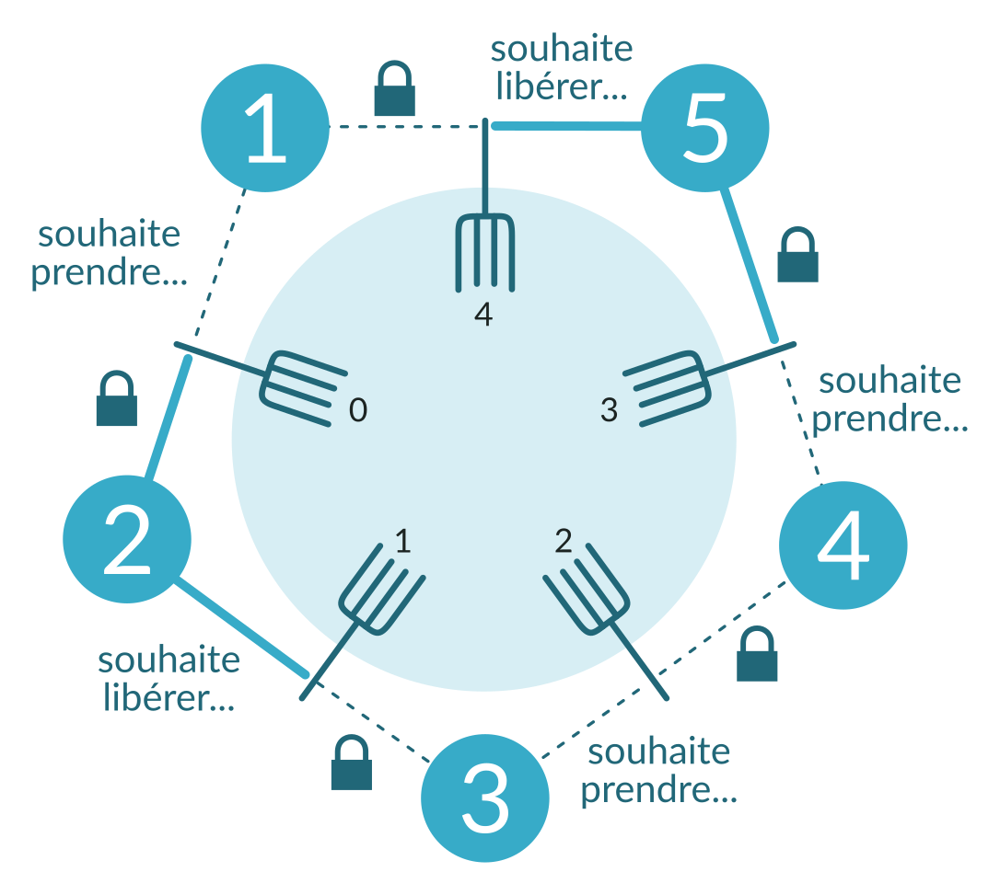

# Compte-rendu TP "Réalisation d’un mini noyau temps réel - Partie 5"

**Mewen Michel et Sander Ricou - MI11 UTC**

### Partie 5 : le dîner des philosophes
Afin de résoudre le célèbre problème du dîner des philosophes, nous avons choisi de représenter chaque fourchette par un sémaphore. Nous avons donc créé un sémaphore d'exlusion mutuelle par fourchette pour pouvoir accéder à leur statut.

Dans un premier temps, nous avions fait un test avec une exclusion mutuelle sur l'usage de la fourchette. Le sémaphore était pris le temps où la fourchette était occupée.
```c
if (s_info( FOURCHETTEG ) == 0
      && s_info( FOURCHETTED ) == 0) {
    // Shotgun !!
    s_wait(FOURCHETTEG);
    s_wait(FOURCHETTED);
    printf("Phil%d mange !\n", _tache_c);
    wait(EAT_TIME);
    s_signal(FOURCHETTEG);
    s_signal(FOURCHETTED);
    break;
}
```
Ça nous a mené très rapidement à une situation problématique : entre la vérification de l'état du sémaphore (`s_info`) et la prise de celui-ci (`s_wait`), une fourchette pouvait être prise par un autre philosophe, nous conduisant à une situation d'interblocage (attente d'une fourchette qu'on pensait libre).

Suite à cela, nous avons préféré sauvegarder l'état des fourchettes dans des variables en les protégeant par un sémaphore pour l'accès en lecture et en écriture. Nous avons abouti aux structures de données suivantes :

```c
#define NB_PHILOSOPHES	5
#define THINK_TIME		10000
#define EAT_TIME		10000
#define FREE			0       // état d'une fourchette libre
#define TAKEN			1       // état d'une fourchette occupée

ushort sems[NB_PHILOSOPHES+1];  // tableau des sémaphores des fourchettes
ushort forks[NB_PHILOSOPHES];   // tableau des états (FREE ou TAKEN) des fourchettes
```

Nous avons donc créé, dans un tâche dédiée, les sémaphores liés aux fourchettes et initialisé l'état des fourchettes. Nous avons initilisé les sémaphores à 1 car il ne peut y avoir qu'un philisophe à vérifier et modifier l'état d'une fourchette à un moment donné.

```c
TACHE	diner(void)
{
  puts("------> Le diner est servi ! Spaghetti pour tout le monde !");
  int i;

  // Initialisation des sémaphores pour les états des fourchettes
  for(int i = 1; i < NB_PHILOSOPHES + 1; i++) {
	  sems[i] = s_cree( 1 );
  }
  sems[0] = sems[NB_PHILOSOPHES];

  // Initialisation des états des fourchettes
  for(int i = 0; i < NB_PHILOSOPHES; i++) {
	  forks[i] = FREE; // the fork is free
  }

  // Initialisation des tâches philosophes
  for(i=0; i<NB_PHILOSOPHES; i++){
	  active(cree(philosophe));
  }
  
  fin_tache();
}

```
Dans une première version, les opérations sur les fourchettes n'étaient réalisées que si l'on pouvez accéder en même temps aux deux fourchettes. Or cela crée une situation d'interblocage, en effet quand on arrive à avoir accès à la fourchette gauche on attend également d'avoir accès la celle de droite (problème si celle-ci n'est pas accessible). Ainsi si tous les philosophes effectuent la situation précédente, chacun vérouille la fouchette à sa gauche et on se retrouve en interblocage.
Le code suivant est donc problématique:
```c
    /*
    // Attention, créer une jolie situation d'interblocage !
    s_wait(leftFork);
    s_wait(rightFork);
    
    forks[leftFork] = FREE;
    forks[rightFork] = FREE;
    
    s_signal(leftFork);
    s_signal(rightFork);
    */
```    
Cette situation peut être illustrée par le schéma suivant:


Détaillons maintenant la tâche philosophe:
Chaque philosophe se voit attribuer une fourchette gauche et une fourchette droite, puis le philosophe rentre dans sa phase de réflexion (`wait(THINK_TIME * _tache_c * _tache_c)`), et se retrouve donc en situation de faim à la fin de celle-ci.
C'est donc le moment pour le philosophe d'essayer d'accèder aux états des ces fourchettes voisines afin d'écrire qu'elles sont utilisées. Tant qu'il n'a pas réussi à récupérer les deux fourchettes en même temps, il réessaie en attendant un court instant à chaque fois (`wait(RETRY_TIME)`).
Notons que si le philosophe accède à une fourchette à l'état `TAKEN`, son accès est tout de suite libérer (éviter un interblocage). C'est seulement quand il accède aux deux fourchettes dans un état `FREE` qu'il va alors se les approprier (écriture de `TAKEN`) et libérer ensuite l'accès aux états des fourchettes. Puis on simule une durée pendant laquelle le philosophe mange (`wait(EAT_TIME)`). A la fin de cette attente, le philosophe va libérer les fourchettes l'une après l'autre (pour éviter la situation d'interblocage détailler précédemment).
Et suite à cela le philosophe se remet à penser...

Voici ci-dessous notre version finale de la tâche philosophe:
```c

TACHE	philosophe()
{
	ushort leftFork = sems[_tache_c-1];
	ushort rightFork = sems[_tache_c];
	printf("------> DEBUT Phil%d ayant acces aux fourchetes fourchettes %d et %d\n", _tache_c, leftFork, rightFork);
    while(1) {
        printf("[%d] pense\n", _tache_c);
        wait(THINK_TIME * _tache_c * _tache_c);
        printf("[%d] a faim\n", _tache_c);

        while(1) {
            wait(RETRY_TIME);	// laisse du temps au voisin qui mange pour reposer sa fourchette

        	// printf("[%d] voit g %d\n", _tache_c, leftFork);
            s_wait(leftFork);
            if(forks[leftFork] == TAKEN) {
                s_signal(leftFork);
                continue;
            }
            // printf("[%d] voit d %d\n", _tache_c, rightFork);
            s_wait(rightFork);

            if(forks[leftFork] == FREE
                && forks[rightFork] == FREE) {
                // Arrêtons cette attente active que je ne saurais voir !
                break;
            }

            //  Les fourchettes sont occupées...
            s_signal(leftFork);
            s_signal(rightFork);
        }

        // Elle sont libres ! Prenons les de ce pas
        forks[leftFork] = TAKEN;
        forks[rightFork] = TAKEN;

        s_signal(leftFork);
        s_signal(rightFork);

        // MANGER !!
        printf("[%d] mange avec %d et %d\n", _tache_c, leftFork, rightFork);
        wait(EAT_TIME);
        printf("[%d] a fini de manger\n", _tache_c, leftFork, rightFork);

        // Libérez les fourchettes, libérez les fourchettes !
        s_wait(leftFork);
        // printf("[%d] voit g %d\n", _tache_c, leftFork);
        forks[leftFork] = FREE;
        s_signal(leftFork);

        s_wait(rightFork);
        // printf("[%d] voit d %d\n", _tache_c, rightFork);
        forks[rightFork] = FREE;
        s_signal(rightFork);

        printf("[%d] a libere %d et %d\n", _tache_c, leftFork, rightFork);
        printf("ETAT    [%d | %d | %d | %d | %d]\n", forks[0], forks[1], forks[2], forks[3], forks[4]);
//        printf("VERROUS [%d | %d | %d | %d | %d]\n", s_info(0), s_info(1), s_info(2), s_info(3), s_info(4));
    }
    printf("------> FIN Phil%d\n", _tache_c);
    fin_tache();
}
```

Veuillez trouver ci dessous le résultat de notre programme:

```
Le diner des philosophes
------> Le diner est servi ! Spaghetti pour tout le monde !
------> DEBUT Phil1 ayant acces aux fourchettes 4 et 0
------> DEBUT Phil2 ayant acces aux fourchettes 0 et 1
[2] pense
[1] pense
------> DEBUT Phil3 ayant acces aux fourchettes 1 et 2
[3] pense
------> DEBUT Phil4 ayant acces aux fourchettes 2 et 3
[4] pense
------> DEBUT Phil5 ayant acces aux fourchettes 3 et 4
[5] pense
[1] a faim
[1] mange avec 4 et 0
[1] a fini de manger
[1] a libere 4 et 0
ETAT    [0 | 0 | 0 | 0 | 0]
[1] pense
[1] a faim
[1] mange avec 4 et 0
[2] a faim
[1] a fini de manger
[1] a libere 4 et 0
ETAT    [0 | 0 | 0 | 0 | 0]
[2] mange avec 0 et 1
[1] pense
[2] a fini de manger
[2] a libere 0 et 1
ETAT    [0 | 0 | 0 | 0 | 0]
[2] pense
[1] a faim
[1] mange avec 4 et 0
[1] a fini de manger
[1] a libere 4 et 0
ETAT    [0 | 0 | 0 | 0 | 0]
[1] pense
[1] a faim
[1] mange avec 4 et 0
[1] a fini de manger
[1] a libere 4 et 0
ETAT    [0 | 0 | 0 | 0 | 0]
[1] pense
[3] a faim
[3] mange avec 1 et 2
[2] a faim
[1] a faim
[1] mange avec 4 et 0
[3] a fini de manger
[3] a libere 1 et 2
ETAT    [1 | 0 | 0 | 0 | 1]
[1] a fini de manger
[1] a libere 4 et 0
ETAT    [0 | 0 | 0 | 0 | 0]
[3] pense
[2] mange avec 0 et 1
[1] pense
[2] a fini de manger
[2] a libere 0 et 1
ETAT    [0 | 0 | 0 | 0 | 0]
[2] pense
[1] a faim
[1] mange avec 4 et 0
[1] a fini de manger
[1] a libere 4 et 0
ETAT    [0 | 0 | 0 | 0 | 0]
[1] pense
[1] a faim
[1] mange avec 4 et 0
[1] a fini de manger
[1] a libere 4 et 0
ETAT    [0 | 0 | 0 | 0 | 0]
[1] pense
[2] a faim
[2] mange avec 0 et 1
[1] a faim
[4] a faim
[4] mange avec 2 et 3
[2] a fini de manger
[2] a libere 0 et 1
ETAT    [0 | 0 | 1 | 1 | 0]
[2] pense
[1] mange avec 4 et 0
[4] a fini de manger
[4] a libere 2 et 3
[1] a fini de manger
[1] a libere 4 et 0
ETAT    [0 | 0 | 0 | 0 | 0]
[1] pense
ETAT    [0 | 0 | 0 | 0 | 0]
[4] pense
[1] a faim
[1] mange avec 4 et 0

...
```

On observe bien qu'à certains moments plusieurs philosophes mangent en même temps :
```
[3] mange avec 1 et 2
[2] a faim
[1] a faim
[1] mange avec 4 et 0
```
De plus aucune situation d'interblocage n'est rencontrée.

