# Compte-rendu TP "Mdélisation AADL et ordonnancement"

**Mewen Michel et Sander Ricou - MI11 UTC**

Nous avons commencé le TP en ajoutant à Eclipse le plugin OSATE, puis en créant un lanceur pour Cheddar afin d'effectuer des simulations d'ordonnançabilité.

### Exercice 1 : Ordonnancement Rate Monotonic

Pour les questions suivantes nous avons trois tâches périodiques se définissant ainsi:
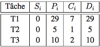

Rappel, Le critère d'ordonnancabilité en Rate Monotonic est :
$$
U = \sum_{i=1}^{n} \frac{C_i}{P_i} \leq n (2^{1/n} - 1) = 0.779 \mbox{ pour n=3}
$$

Q1. 
$$
U = \frac{7}{29} + \frac{1}{5} + \frac{2}{10} = 0.641 \leq 0.779
$$
Le résultat nous informe donc que l'ensemble des tâches est ordonnançable.

Q2. Le critère de priorité est inversement proportionnelle à la période Pi. Plus la période est petite plus la tâche est prioritaire.
Donc nous avons :
 - T2, priorité de 255
 - T3, priorité de 254
 - T1, priorité de 253

Q3. On ajoute les paramètres suivants aux tâches:
  - "Period" 
  - "Compute_Execution_Time" 
  - "Deadline" 
  - "Cheddar_Properties::Dispatch_Absolute_Time" 

  et dans l'ordonnanceur nous ajoutons:
  - "Preemtive_Scheduler => False or True" par défaut en non preemptable.

Code après ajout des paramètres dans une tâche:
  ```aadl
  thread implementation T1.impl
  properties
    Period => 30ms ;
    Compute_Execution_Time =>  6ms .. 6ms;
    Deadline => 30ms ;
    Cheddar_Properties::Dispatch_Absolute_Time => 0ms; 
    Dispatch_Protocol => Periodic ;
end T1.Impl;
  ```

Code pour l'ordonnanceur:
```aadl
processor implementation cpu.impl
  properties 
    Scheduling_Protocol => RATE_MONOTONIC_PROTOCOL;
    Cheddar_Properties::Preemptive_Scheduler => False ;
end cpu.impl;
```

Q4. Ordonnancement preemptif:
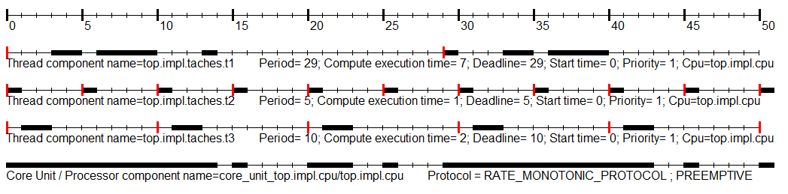
Avec la sortie Cheddar suivante:
```
Scheduling feasibility, Processor component top.impl.cpu : 
1) Feasibility test based on the processor utilization factor : 

- The hyperperiod is 290 (see [18], page 5). 
- 104 units of time are unused in the hyperperiod.
- Processor utilization factor with deadline is 0.64138 (see [1], page 6). 
- Processor utilization factor with period is 0.64138 (see [1], page 6). 
- In the preemptive case, with RM, the thread component set is schedulable because the processor utilization factor 0.64138 is equal or less than 0.77976 (see [1], page 16, theorem 8). 


2) Feasibility test based on worst case thread component response time : 

- Worst case thread component response time :  (see [2], page 3, equation 4). 
    top.impl.taches.t1 => 14
    top.impl.taches.t3 => 3
    top.impl.taches.t2 => 1
- All thread component deadlines will be met : the thread component set is schedulable.

```

Ordonnancement non preemptif:
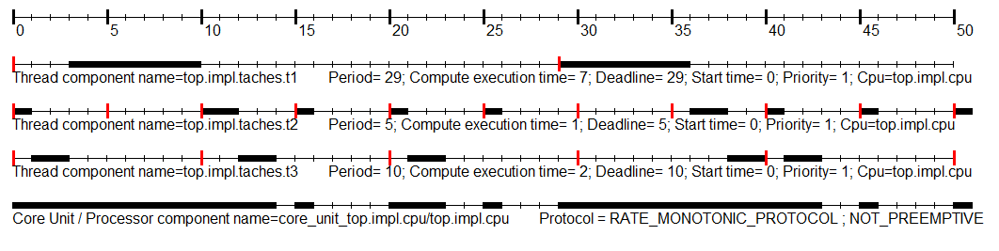

Avec la sortie Cheddar suivante:
```
Scheduling feasibility, Processor component top.impl.cpu : 
1) Feasibility test based on the processor utilization factor : 

- The hyperperiod is 290 (see [18], page 5). 
- 104 units of time are unused in the hyperperiod.
- Processor utilization factor with deadline is 0.64138 (see [1], page 6). 
- Processor utilization factor with period is 0.64138 (see [1], page 6). 
- In the non preemptive case, with RM, we can not prove that thread components are schedulable because one or many thread components doesn't/don't satisfy the processor utilization factor feasibility test (see [3]).
  List of concerned thread components : top.impl.taches.t2 top.impl.taches.t3 

2) Feasibility test based on worst case thread component response time : 

- Worst case thread component response time :  (see [1], page 36, equation 13). 
    top.impl.taches.t1 => 10
    top.impl.taches.t3 => 10
    top.impl.taches.t2 => 7,  missed its deadline (deadline =  5)
- Some thread component deadlines will be missed : the thread component set is not schedulable.
```


On constate que l'ordonnacement en non preemptif ne fonctionne pas, ce n'est pas schedulable. Ceci à cause de la première tâche (celle à la plus longue période) qui fait manquer les deadlines d'autres tâches.

En ordonnancement rate monotonic, avec des tâches non harmoniques, il peut y avoir des moments où on ne peut rien faire, où les tâches sont obligées d'attendre ce qui fait que la période d'étude n'est pas pleinement occupée. Analysons alors le comportement de tâches harmoniques.


Q5. Formons maintenant un jeu de tâche harmonique.

Par le calcul du critère d'ordonnançabilité, on trouve que les tâches ne sont pas ordonnançables:
$$
U = \frac{6}{30} + \frac{3}{5} + \frac{2}{10} = 1 > 0.779
$$

Preemptif:
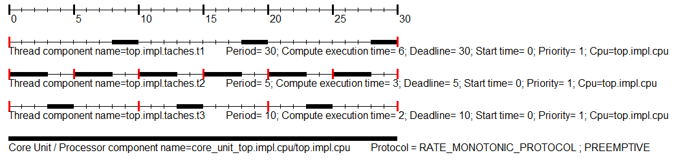
Pour ne pas surcharger le rapport à partir de maintenant nous n'afficherons que les parties des logs Cheddar qui nous intéresse, autrement dit le taux d'utilisation du processeur ainsi que les temps de réponse des tâches.

Non preemptif:
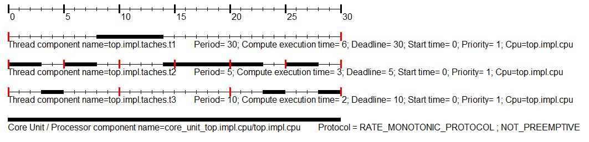
Avec la sortie Cheddar suivante:
```
- The hyperperiod is 30.
- 0 units of time are unused in the hyperperiod.
- Processor utilization factor with deadline is 1.00000. 

- Worst case thread component response time :  
    top.impl.taches.t1 => 14
    top.impl.taches.t3 => 16,  missed its deadline (deadline =  10)
    top.impl.taches.t2 => 8,  missed its deadline (deadline =  5)
- Some thread component deadlines will be missed : the thread component set is not schedulable.
```

On constate que c'est encore pire quand question 4 si les tâches ne sont pas preemptables. Cela s'explique par le fait que les tâches sont censés occuper la totalité de la période d'étude (U = 1). Or si elle ne peuvent se preempter les unes les autres, certaines ne vont pas être terminer avant leur deadline.

De plus on constate que si le test d'ordonnançabilité est vrai alors l'ordonnacement est possible mais l'inverse n'est pas forcément vrai (condition suffisante). En effet c'est bien le cas ici, nous avons un critère d'ordonnançabilité égale à 1 et donc supérieur à 0,78 mais Cheddar arrive tout de même à les ordonnancer. Il faut également prendre en compte les temps de réponse de chaque tâche pour savoir si elles sont réellement ordonnançable ou pas.


Q6. Voici les différents temps de réponse donnés par Cheddar:

```
- Worst case thread component response time : 
    top.impl.taches.t1 => 30
    top.impl.taches.t3 => 5
    top.impl.taches.t2 => 3
- All thread component deadlines will be met : the thread component set is schedulable.
```
Vu les temps de réponse on voit qu'on respecte les deadlines alors qu'on a calculé un U trop grand...(test ordonnançabilité faux).


### Exercice 2 : Ordonnancement EDF

Nous avons maintenant trois nouvelles tâches périodiques, définies par:
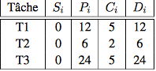

Q1. 
$$
U = \frac{5}{12} + \frac{2}{6} + \frac{5}{24} = \frac{23}{24} < 1
$$
Le jeu de tâche est donc ordonnançable !

Q2. Voici le code de notre fichier test_edf.aadl:
```aadl
thread T1
end T1;

thread implementation T1.impl
  properties
    Period => 12ms ;
    Compute_Execution_Time =>  5ms .. 5ms;
    Deadline => 12ms ;
    Cheddar_Properties::Dispatch_Absolute_Time => 0ms; 
    Dispatch_Protocol => Periodic ;
end T1.Impl;

thread T2
end T2;

thread implementation T2.impl
  properties
    Period => 6ms ;
    Compute_Execution_Time =>  2ms .. 2ms;
    Deadline => 6ms ;
    Cheddar_Properties::Dispatch_Absolute_Time => 0ms;
    Dispatch_Protocol => Periodic ;
end T2.Impl;

thread T3
end T3;

thread implementation T3.impl
  properties
    Period => 24ms ;
    Compute_Execution_Time =>  5ms .. 5ms;
    Deadline => 24ms ;
    Cheddar_Properties::Dispatch_Absolute_Time => 0ms;
    Dispatch_Protocol => Periodic ;
end T3.Impl;

process taches
end taches;

process implementation taches.impl
  subcomponents
    T1 : thread T1.impl;
    T2 : thread T2.impl;
    T3 : thread T3.impl;
end taches.impl;

processor cpu
end cpu;

processor implementation cpu.impl
  properties 
    Scheduling_Protocol => EARLIEST_DEADLINE_FIRST_PROTOCOL;
    Cheddar_Properties::Preemptive_Scheduler => True ;
end cpu.impl;


system top
end top;

system implementation top.impl
  subcomponents
    cpu : processor cpu.impl;
    taches : process taches.impl;
  properties
    Actual_Processor_Binding => reference cpu applies to taches;
end top.impl;

```

Q3. Il y a une unité de temps libre sur la période d'étude. En effet on a une période de 24 unités et elle est utilisée pendant 23/24 de son temps donc il reste 1/24*24= 1 unité de temps.

Q4. Voir schéma ordonnancement. et temps de réponse même.
Preemptif:
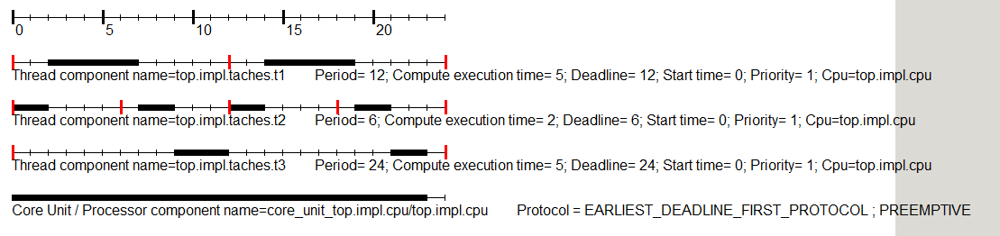
Avec le retour Cheddar suivant:
```
- The hyperperiod is 24.
- 1 units of time are unused in the hyperperiod.
- Processor utilization factor with deadline is 0.95833.

- Worst case thread component response time : 
    top.impl.taches.t1 => 11
    top.impl.taches.t2 => 5
    top.impl.taches.t3 => 23
- All thread component deadlines will be met : the thread component set is schedulable.
```

Non preemptif:

Avec le retour Cheddar suivant:
```
- The hyperperiod is 24. 
- 1 units of time are unused in the hyperperiod.
- Processor utilization factor with deadline is 0.95833.

- Worst case thread component response time : 
    top.impl.taches.t1 => 21,  missed its deadline (deadline =  12)
    top.impl.taches.t2 => 5
    top.impl.taches.t3 => 42,  missed its deadline (deadline =  24)
- Some thread component deadlines will be missed : the thread component set is not schedulable.

```

Nous constatons bien l'unité de temps disponible sur le schéma en preemptif et qui est également confirmer par les logs Cheddar.


Q5. Voici le bout de code ajouté pour les deux tâches apériodiques TA1 et TA2:
```aadl
thread TA1
end TA1;

thread implementation TA1.impl
  properties
    Compute_Execution_Time =>  1ms .. 1ms;
    Deadline => 96ms ;
    Cheddar_Properties::Dispatch_Absolute_Time => 7ms;
    Dispatch_Protocol => Background ;
end TA1.Impl;

thread TA2
end TA2;

thread implementation TA2.impl
  properties
    Compute_Execution_Time =>  3ms .. 3ms;
    Deadline => 96ms ;
    Cheddar_Properties::Dispatch_Absolute_Time => 12ms;
    Dispatch_Protocol => Background ;
end TA2.Impl;

...
...

process implementation taches.impl
  subcomponents
    T1 : thread T1.impl;
    T2 : thread T2.impl;
    T3 : thread T3.impl;
    TA1 : thread TA1.impl;
    TA2 : thread TA2.impl;
end taches.impl;

```


Schéma d'ordonnancement pour le cas preemptif:
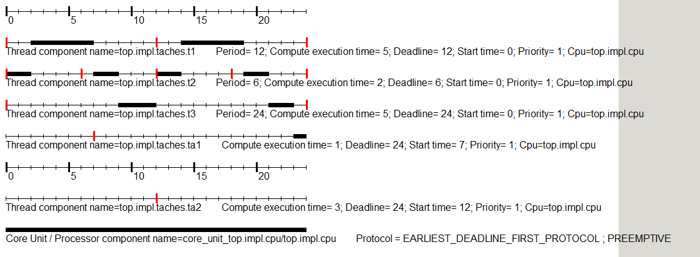

on sait qu'il y a 1 unité de temps disponible par période d'étude, et la somme des temps d'exécution des deux tâches apériodiques est égale à 4 donc il faudra une deadline de 4*24= 96 pour avoir les tâches apériodiques qui s'éxécutent sans perturber les autres.

Si on donne une deadline de 24 aux tâches apériodiques alors celles-ci vont mettre la tâche 3 en retard. Elle le rattrapera arrivé à 96 unité de temps, ce qui est logique (cf. paragraphe précédent). En fait, la TA2 prend 3 unité de temps dans la première période d'étude à la tâche 3 il faudra donc 3 période d'étude pour que la tâche 3 rattrape son retard (1 unité de temps reprise par période d'étude), ce qui fait bien 24 + 3*24 = 96.

Voici les répercussions sur l'ordonnancement en fonction de la valeur de deadline choisie:

Deadline de 24, 
1ère partie:
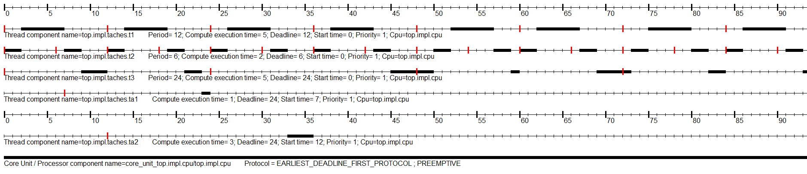
2eme partie:
.PNG)

Deadline de 96, 
1ère partie:
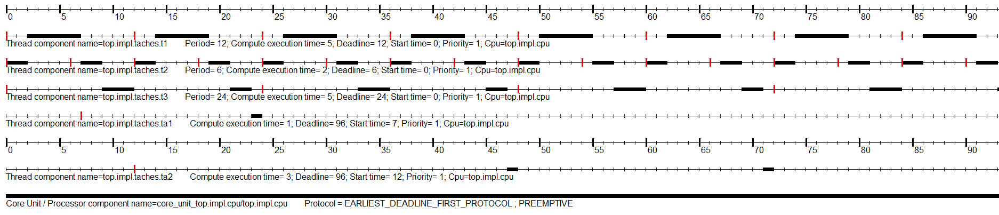
2eme partie:
.PNG)


### Exercice 3 : Moniteur médical multiparamètres

Q1.
Voici les différents critères qui nous ont permis d'affecter les priorités aux tâches:

- Criticité ou l'importance de la tâche, vaut il mieux déclencher cette tâche au lieu d'une autre ?

- Plus important de Checker des que possible pour éventuellement déclencher l'alarme au lieu d'afficher par exemple.

- Vitesse d'évolution des paramètres mesurés par la tâche. 

A ces critès quantitatifs s'ajoute également la période de la tâche.

Au final nous avons les priorités suivantes :
1- Check (255)
2- getECG (254)
3- getPA (253)
4- getSO2 (252)
5- dpy (251)

Nous supposons donc que l'affichage est le moins important, l'infirmière ne sera pas tout le temps derrière l'écran pour s'assurer des bons paramètres vitaux. Puis la saturation sanguine met du temps à se produire comparer à l'activité cardiaque. Et donc le plus important est le déclenchement de l'alarme par la tâche check qui a la priorité maximale.

Q2. Voici une partie de notre code pour le fichier health_monitor.aadl, mettant en évidence les modifications apportées:
```aadl
...
...

-- Processeur
processor armadeus
  features
    iobus : requires bus access CAN;
    lvds : requires bus access LVDS;
end armadeus;

processor implementation armadeus.impl
  properties 
    Scheduling_Protocol => POSIX_1003_HIGHEST_PRIORITY_FIRST_PROTOCOL;
    Cheddar_Properties::Preemptive_Scheduler => True ;
end armadeus.impl;

-----------------------
-- Composants logiciels
-----------------------
thread read_sensor
  features
    raw : in data port;
    cooked : out data port;
end read_sensor;

thread implementation read_sensor.PA
  properties
    Period => 10ms ;
    Compute_Execution_Time =>  0ms .. 1ms;
    Deadline => 10ms ;
    Cheddar_Properties::Dispatch_Absolute_Time => 0ms;
    Cheddar_Properties::Fixed_Priority => 253;
    Dispatch_Protocol => Periodic ;
end read_sensor.PA;

thread implementation read_sensor.ECG
  properties
    Period => 40ms ;
    Compute_Execution_Time =>  4ms .. 4ms;
    Deadline => 40ms ;
    Cheddar_Properties::Dispatch_Absolute_Time => 0ms;
    Cheddar_Properties::Fixed_Priority => 254;
    Dispatch_Protocol => Periodic ;
end read_sensor.ECG;

thread implementation read_sensor.SO2
  properties
    Period => 10ms ;
    Compute_Execution_Time =>  0ms .. 2ms;
    Deadline => 10ms ;
    Cheddar_Properties::Dispatch_Absolute_Time => 0ms;
    Cheddar_Properties::Fixed_Priority => 252;
    Dispatch_Protocol => Periodic ;
end read_sensor.SO2;

thread check_bounds
  features
    PA : in data port;
    ECG : in data port;
    SO2 : in data port;
    alarm : out event data port;
end check_bounds;

thread implementation check_bounds.impl
  properties
    Period => 12ms ;
    Compute_Execution_Time =>  0ms .. 2ms;
    Deadline => 12ms ;
    Cheddar_Properties::Dispatch_Absolute_Time => 0ms;
    Cheddar_Properties::Fixed_Priority => 255;
    Dispatch_Protocol => Periodic ;
end check_bounds.impl;

thread display
  features
    PA : in data port;
    ECG : in data port;
    SO2 : in data port;
    fb : out data port;
end display;

thread implementation display.impl
  properties
    Period => 6ms ;
    Compute_Execution_Time =>  0ms .. 1ms;
    Deadline => 6ms ;
    Cheddar_Properties::Dispatch_Absolute_Time => 0ms;
    Cheddar_Properties::Fixed_Priority => 251;
    Dispatch_Protocol => Periodic ;
end display.impl;

process health_monitoring
  features
    PA : in data port;
    ECG : in data port;
    SO2 : in data port;
    fb : out data port;
    alarm : out event data port;
end health_monitoring;

process implementation health_monitoring.impl
  subcomponents
    getPA : thread read_sensor.PA;
    getSO2 : thread read_sensor.SO2;
    getECG : thread read_sensor.ECG;
    dpy : thread display.impl;
    check : thread check_bounds.impl;
  connections
    data port PA -> getPA.raw;
    data port ECG -> getECG.raw;
    data port SO2 -> getSO2.raw;
    data port getPA.cooked -> dpy.PA;
    data port getPA.cooked -> check.PA;
    data port getECG.cooked -> dpy.ECG;
    data port getECG.cooked -> check.ECG;
    data port getSO2.cooked -> dpy.SO2;
    data port getSO2.cooked -> check.SO2;
    data port dpy.fb -> fb;
    event data port check.alarm -> alarm;
end health_monitoring.impl;

...
...

```


Q3. Nous avons le schéma d'ordonnancement suivant,
1ere partie:
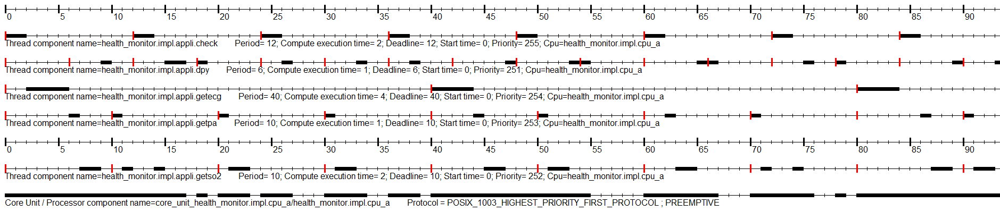

2eme partie:
.PNG)

Seulement la tâche display qui rate ça deadline et seulement une fois par période d'étude, ce qui n'est pas très grave aux vus des arguments exposés à la question 1.


Q4. Pour augmenter les performances du système, les tâches sont réparties sur deux processeurs (cpu_a et cpu_b). Avec les paramètres suivants:


On a alors les critères d'ordonnançabilité suivant:
$$
U_{b1} = \frac{4}{6} + \frac{2}{20} = \frac{46}{60} < 1
$$
$$
U_{a1} = \frac{2}{3} + \frac{2}{5} + \frac{2}{5} = \frac{22}{15} > 1
$$
mais on a aussi :
$$
U_{b1} + U_{a1} \simeq 2.233  > 2
$$

On se rend compte à ce moment là que la répartition des tâches sur les CPU n'est pas correcte. On se retrouve avec des taux d'utilisation trop grand.


La tâche getPA n'arrive pas à s'éxécuter... en effet si on veut excéuter les trois tâches sur le processeur a, il faudrait 147% du processeur, ceci est évidemment impossible.

Schéma d'ordonnancement correspondant:
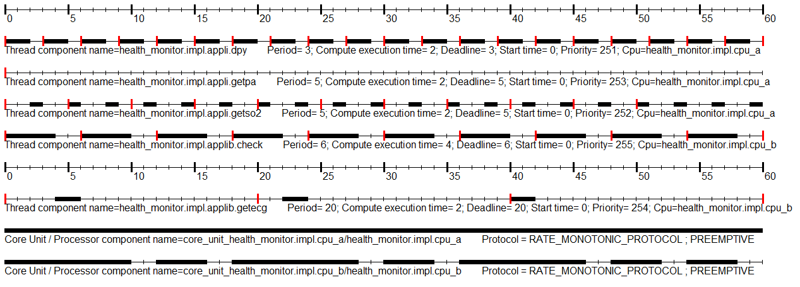

Retour de cheddar,
CPU_A:
```
Scheduling feasibility, Processor component health_monitor.impl.cpu_a : 
1) Feasibility test based on the processor utilization factor : 

- The hyperperiod is 15
- 0 units of time are unused in the hyperperiod.
- Processor utilization factor with deadline is 1.46667.


2) Feasibility test based on worst case thread component response time : 

- Processor utilization exceeded : can not compute bound on response time with this thread component set. 

```
CPU_B:
```
Scheduling feasibility, Processor component health_monitor.impl.cpu_b : 
1) Feasibility test based on the processor utilization factor : 

- The hyperperiod is 60. 
- 14 units of time are unused in the hyperperiod.
- Processor utilization factor with deadline is 0.76667.


2) Feasibility test based on worst case thread component response time : 

- Worst case thread component response time :
    health_monitor.impl.applib.getecg => 6
    health_monitor.impl.applib.check => 4
- All thread component deadlines will be met : the thread component set is schedulable.
```


Q5. En regardant les périodes, on observe que getECG à la plus grande et dpy a la plus petite. Pour une période grande il n'y a pas besoin du cpu le plus rapide et inversement, pour une tâche à période courte il vaut mieux un cpu rapide. Nous échangeons donc les deux tâches de cpu, ce qui implique également de changer les capacité de chacune. On se retrouve alors avec les paramètres suivants:

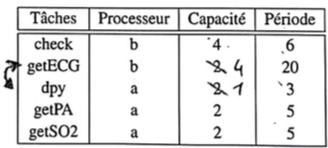

Calcul des critères d'ordonnançabilité:
$$
U_{b2} = \frac{4}{6} + \frac{1}{3} = 1
$$
$$
U_{a2} = \frac{4}{20} + \frac{2}{5} + \frac{2}{5} = 1
$$

Les deux critères sont égaux à 1 ce qui est acceptable mais en réalité impossible car un processeur a besoin d'un minimum de pourcentage de cpu pour ses actions non compréssibles.

Et attention il faut recalculer les priorités en fonction de la période (algo rate_Monotonic), ce qui nous donne l'ordre de priorités suivant:
1- dpy (255)
2- getPA (254)
3- getSO2 (253)
4- check (252)
5- getECG (251)


Q6. Voici le code final, après avoir ajouté les modifications de la questions précédentes:
```aadl

--
-- Description de l'architecture d'un moniteur médical
--
-- Ce moniteur dispose de trois capteurs (SO2, ECG et PA), d'un affichage
-- et d'une fonction alarme qui se déclenche lorsque l'un des paramètres
-- descend en dessous d'un seuil déterminé
--

-----------------------
-- Composants matériels
-----------------------

-- Bus

-- Les capteurs sont sur bus CAN
bus CAN
end CAN;

-- L'afficheur est sur bus LVDS
bus LVDS
end LVDS;


-- Capteurs

-- Capteur saturation O2
device SO2_sensor
  features
    SO2 : out data port;
    iobus : requires bus access CAN;
end SO2_sensor;

device implementation SO2_sensor.impl
end SO2_sensor.impl;

-- Capteur électrocardiogramme
device ECG_sensor
  features
    ECG : out data port;
    iobus : requires bus access CAN;
end ECG_sensor;

device implementation ECG_sensor.impl
end ECG_sensor.impl;

-- Capteur Pression artérielle
device PA_sensor
  features
    PA : out data port;
    iobus : requires bus access CAN;
end PA_sensor;

device implementation PA_sensor.impl
end PA_sensor.impl;

-- Autres périphériques
device LCD_display
  features
    fb : in data port;          -- framebuffer
    lvds : requires bus access LVDS;  -- lcd bus
end LCD_display;
  
device Alarm
  features
    trigger : in event data port;
    iobus : requires bus access CAN;
end Alarm;

-- Processeur
processor armadeus
  features
    iobus : requires bus access CAN;
    lvds : requires bus access LVDS;
end armadeus;

processor implementation armadeus.impl
  properties 
    Scheduling_Protocol => POSIX_1003_HIGHEST_PRIORITY_FIRST_PROTOCOL;
    Cheddar_Properties::Preemptive_Scheduler => True ;
end armadeus.impl;

-----------------------
-- Composants logiciels
-----------------------
thread read_sensor
  features
    raw : in data port;
    cooked : out data port;
end read_sensor;

thread implementation read_sensor.PA
  properties
    Period => 5ms ;
    Compute_Execution_Time =>  2ms .. 2ms;
    Deadline => 5ms ;
    Cheddar_Properties::Dispatch_Absolute_Time => 0ms;
    Cheddar_Properties::Fixed_Priority => 254;
    Dispatch_Protocol => Periodic ;
end read_sensor.PA;

thread implementation read_sensor.ECG
  properties
    Period => 20ms ;
    Compute_Execution_Time =>  4ms .. 4ms;
    Deadline => 20ms ;
    Cheddar_Properties::Dispatch_Absolute_Time => 0ms;
    Cheddar_Properties::Fixed_Priority => 251;
    Dispatch_Protocol => Periodic ;
end read_sensor.ECG;

thread implementation read_sensor.SO2
  properties
    Period => 5ms ;
    Compute_Execution_Time =>  2ms .. 2ms;
    Deadline => 5ms ;
    Cheddar_Properties::Dispatch_Absolute_Time => 0ms;
    Cheddar_Properties::Fixed_Priority => 253;
    Dispatch_Protocol => Periodic ;
end read_sensor.SO2;

thread check_bounds
  features
    PA : in data port;
    ECG : in data port;
    SO2 : in data port;
    alarm : out event data port;
end check_bounds;

thread implementation check_bounds.impl
  properties
    Period => 6ms ;
    Compute_Execution_Time =>  4ms .. 4ms;
    Deadline => 6ms ;
    Cheddar_Properties::Dispatch_Absolute_Time => 0ms;
    Cheddar_Properties::Fixed_Priority => 252;
    Dispatch_Protocol => Periodic ;
end check_bounds.impl;

thread display
  features
    PA : in data port;
    ECG : in data port;
    SO2 : in data port;
    fb : out data port;
end display;

thread implementation display.impl
  properties
    Period => 3ms ;
    Compute_Execution_Time =>  1ms .. 1ms;
    Deadline => 3ms ;
    Cheddar_Properties::Dispatch_Absolute_Time => 0ms;
    Cheddar_Properties::Fixed_Priority => 255;
    Dispatch_Protocol => Periodic ;
end display.impl;

process health_monitoring
  features
    PA : in data port;
    SO2 : in data port;
    fb : out data port;
end health_monitoring;

process health_monitoringb
  features
    ECG : in data port;
    alarm : out event data port;
end health_monitoringb;

process implementation health_monitoring.impl
  subcomponents
    getPA : thread read_sensor.PA;
    getECG : thread read_sensor.ECG;
    getSO2 : thread read_sensor.SO2;
end health_monitoring.impl;

process implementation health_monitoringb.impl
  subcomponents
    dpy : thread display.impl;
    check : thread check_bounds.impl;
end health_monitoringb.impl;

------------------
-- système complet
------------------
system health_monitor
end health_monitor;

system implementation health_monitor.impl
  subcomponents
    -- Les bus
    can : bus CAN;
    lvds : bus LVDS;
    
    -- Les processeurs
    cpu_a : processor armadeus.impl;
    cpu_b : processor armadeus.impl;
    
    -- Les capteurs
    SO2_sense : device SO2_sensor;
    PA_sense : device PA_sensor;
    ECG_sense : device ECG_sensor;
    
    -- Les périphériques de sortie
    lcd : device LCD_display;
    alarm : device Alarm;
    
    -- L'application
    appli : process health_monitoring.impl;
    applib : process health_monitoringb.impl;
    
  --connections
    -- connexions de bus
    --bus access can -> SO2_sense.iobus;
    --bus access can -> PA_sense.iobus;
    --bus access can -> ECG_sense.iobus;
   -- bus access can -> alarm.iobus;
   -- bus access can -> cpu_a.iobus;
       
    --bus access lvds -> lcd.lvds;
    --bus access lvds -> cpu_a.lvds;
  
    -- connexions de ports
    --so2_conn : data port SO2_sense.SO2 -> appli.SO2;
    --pa_conn : data port PA_sense.PA -> appli.PA;
    --ecg_conn : data port ECG_sense.ECG -> appli.ECG;
    --fb_conn : data port appli.fb -> lcd.fb;
    --alarm_conn : event data port appli.alarm -> alarm.trigger;
    
  properties
    -- Allocation logiciel - plateforme d'exécution
    Actual_Processor_Binding => reference cpu_a applies to appli;
    Actual_Processor_Binding => reference cpu_b applies to applib;
    
    --Actual_Connection_Binding => reference can applies to so2_conn;
   -- Actual_Connection_Binding => reference can applies to pa_conn;
    --Actual_Connection_Binding => reference can applies to ecg_conn;
    --Actual_Connection_Binding => reference can applies to alarm_conn;
    --Actual_Connection_Binding => reference lvds applies to fb_conn;
end health_monitor.impl;
```


On se retrouve alors avec le schéma d'ordonnancement suivant:
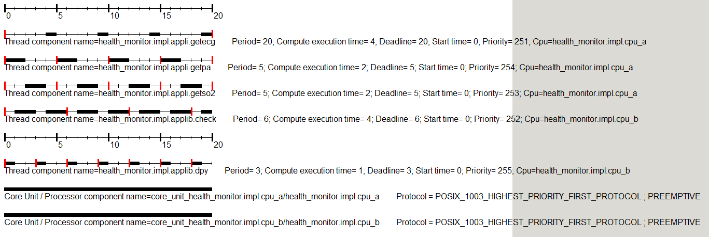

La réponse de Cheddar,
CPU_A:
```
Scheduling feasibility, Processor component health_monitor.impl.cpu_a : 
1) Feasibility test based on the processor utilization factor : 

- The hyperperiod is 20.
- 0 units of time are unused in the hyperperiod.
- Processor utilization factor with deadline is 1.00000.

2) Feasibility test based on worst case thread component response time : 

- Worst case thread component response time :
    health_monitor.impl.appli.getecg => 20
    health_monitor.impl.appli.getso2 => 4
    health_monitor.impl.appli.getpa => 2
- All thread component deadlines will be met : the thread component set is schedulable.

```

CPU_B:
```
Scheduling feasibility, Processor component health_monitor.impl.cpu_b : 
1) Feasibility test based on the processor utilization factor : 

- The hyperperiod is 6.
- 0 units of time are unused in the hyperperiod.
- Processor utilization factor with deadline is 1.00000.

2) Feasibility test based on worst case thread component response time : 

- Worst case thread component response time :
    health_monitor.impl.applib.check => 6
    health_monitor.impl.applib.dpy => 1
- All thread component deadlines will be met : the thread component set is schedulable.

```

Au final nous avons bien les deux CPUs qui ordonnancent correctement leurs tâches, avec une période d'étude complétement utilisée.