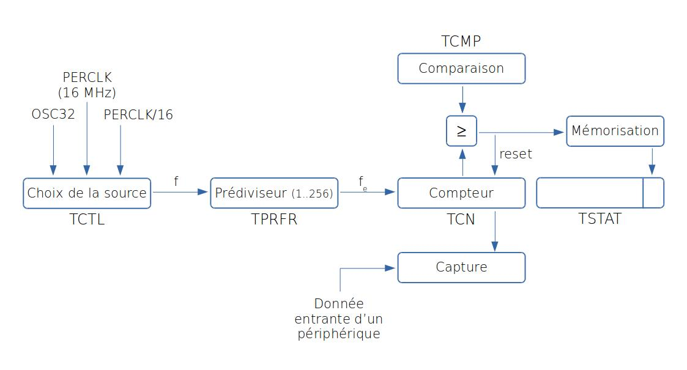

# MI11 - Rapport TD 1 à 3

## TD 1
Le but de ce TD était de prendre en main la chaîne de compilation afin de préparer une image mémoire correcte pour notre cible.

Nous avons donc préparé un programme C simple :
```c
int a;
int b = 1;
static int c;
char * s = "Salut";

int main(void){
	// Main qui ne quitte pas
    while(1){
        c = 42;
        a = a + b + c + s[1] + f();
    } 
}
```

Nous avons utilisé les utilitaires suivants (penser à les préfixer par `arn-none-eabi-` afin d'obtenir la version dédiée à notre architecture) :
* 
* `objdump` (`-ths`)
* 

Au final, notre programme chargé à l'adresse `0x08000000` (début de la mémoire volatile SDRAM) plante à la première instruction (qui est un `push`) car le pointeur de pile `sp_svc` n'est pas initialisé.

## TD 2
### Paramétrage d'Eclipse
Afin de réaliser les opérations de la partie 1 plus facilement, nous avons suivi le [tutoriel sur Moodle](http://moodle.utc.fr/pluginfile.php/61465/mod_resource/content/4/eclipse_debug.pdf) afin de paramétrer Eclipse pour automatiser la compilation, l'édition des lien, le transfert de l'image mémoire et le débug sur cible depuis l'hôte.

Nous avons ensuite repris notre programme du TD1. Nous avons modifié le script d'édition de lien `armtd2.x` en ajoutant la ligne suivante :
```C
. = 0x08000000; // décale les instructions qui suivent à cette adresse mémoire
```
Nous avons trouvé cette valeur dans le [manuel utilisateur de la carte MC9328MX1](http://moodle.utc.fr/pluginfile.php/38071/mod_resource/content/0/Sujets_TP/Etude_de_cas/MC9328MX1RM.pdf) ; elle correspond à la première adresse mémoire de SDRAM.

Attention :
* cette zone est volatile, à chaque redémarrage de la cible le code transféré sera perdu
* contrairement à ce qui est écrit dans le manuel utilisateur, il n'y a pas 128 MB de SDRAM mais 16 uniquement dans l'implémentation utilisée

Cependant, le programme ne fonctionne toujours pas, encore pour la même raison. Afin de le faire fonctionner, nous avons modifié le registre de pile `sp_svc` afin de l'initialiser quelque part dans la SDRAM (disons `0x08001000`). On peut maintenant observer l'exécution correcte de notre code sur la cible.

Il n'est cependant pas envisageable de modifier les registres à la main à chaque exécution, il va donc falloir faire quelques initialisations avant de lancer notre code C. De ce fait, nous allons coder cette partie en **assembleur**.

### Initialisation de la cible en assembleur
Note :
* un fichier source assembleur a pour extension `.S` (s **majuscule**)
* contrairement au C, il faut préciser dans quelle section placer les lignes de codes suivantes

Grâce au programme en assembleur nous allons initialiser `sp` (le pointeur de pile), initialiser la zone `bss` à 0 en mémoire et enfin appeler notre fonction main pour commencer son exécution.

On ajoute a notre script de lien les variables `bss_start` et `bss_size`, on pourra récupérer ces valeurs depuis le code assembleur ce qui va nous permettre de mettre toutes les valeurs de bss à 0.
En faisant un objdump, on remarque que deux variables appartiennent à .bss (a et c), elles sont codées sur 32 bits chacune, donc 4 octets chacune et on retrouve bien une taille de bss égale à 8.

PAS TERMINE, il faut finir le code assembleur, l'utilisation des variables du script de liens ne fonctionnent pas
au retour de main, faire une boucle infini (b.) ou réexcuter le code sinon on laisse le proceseur continuer son chemin et faire n'importe quoi...

## TD 3
Dans ce TD, nous reprenons le code des semaines passées permettant de préparer la cible pour accueillir et exécuter notre code C cross-compilé.
Nous allons réaliser un petit programme pour faire clignoter à 2Hz la LED reliée au port GPIO D-31.

### Allumage de la LED
#### Modifier les bits voulus en mémoire
Note :
* Un bit n'est pas adressable directement, il faut accéder à un octet au minimum. Il est plus aisé sur ARM de travailler avec les mots mémoire de 32 bits.

Pour modifier un mot mémoire, plusieurs méthodes existent :
* Pour modifier un bit uniquement :
    *  lire le mot mémoire
    *  appliquer un masque en utilisant les opérateurs binaires suivants
        *  `&` (et logique) : permet de passer des bits à 0,
        *  `|` (ou inclusif) : permet de passer des bits à 1,
        *  et `~` (non logique) : permet d'inverser le masque,
    *  écrire le nouveau mot en mémoire
*  Pour modifier l'octet ou le mot mémoire en entier. C'est possible de réaliser cela dans notre cas car nous travaillons sur une cible dédiée. Il faut simplement :
    *  affecter la valeur voulue à la partie de la mémoire voulue

#### Paraméter notre LED
Les adresses de registre GPIO se trouvent de `0x0021C000` à `0x0021CFFF` (4KB). Dans notre cas, `i` vaut 31. Pour paramétrer notre pin GPIO, il faut réaliser les étapes suivantes :
* Mettre le bit `i` du registre du port GPIO D dans le `use register` (`GIUS_D` à l'adresse `0x0021C320`) à 1 :
```c
unsigned int mask_gius = 0x80000000;
ptr = (unsigned int*)0x0021C320;
*ptr = *ptr | mask_gius;
```
* Mettre les bits [2i-32+1] (= 31) et [2i-32] (= 30) du `configuration register` 1 (`OCR2_D` à l'adresse `0x0021C308`) à 1 tous les deux :
```c
unsigned int mask_ocr2 = 0xC0000000;
ptr = (unsigned int*)0x0021C308;
*ptr = *ptr | mask_ocr2;
```
* Écrire les valeurs désirée sur le bit `i` du `port D data register` (`DR_D` à l'adresse `0x0021C31C`). Cette valeur sera 0 (`LOW`) dans notre cas car la borne de la LED qui n'est pas branchée à la pin GPIO est connectée au +xV :
```c
unsigned int mask_dr = 0x80000000;
ptr = (unsigned int*)0x0021C31C;
*ptr = *ptr & ~mask_dr;
```
* Mettre le bit `i` du `data direction register` (`DDIR_D` à l'adresse `0x0021C3000`) à 0 pour définir la pin comme sortie :
```c
unsigned int mask_ddir = 0x80000000;
ptr = (unsigned int*)0x0021C300;
*ptr = *ptr | mask_ddir;
```
La LED s'allume \o/

### Clignotement de la LED (version approximative)
Afin d'éteindre la LED, il suffit de changer la valeur de la pin :
```c
ptr = (unsigned int*)0x0021C31C;
*ptr = *ptr | mask_dr;
```

Pour pouvoir faire clignoter la LED, il va falloir attendre un peu une fois qu'on l'a allumée et une fois qu'on l'a éteinte. On peut faire ça en occupant notre processeur pendant un moment à ne rien faire :
```c
for (b = 0; b<100000; b++){
    a *= 2;
    a /= 2;
}
```

Mais ça n'est pas très joli, utilisons plutôt l'horloge de la cible.

### Clignotement de la LED (version précise)
Le fonctionnement du timer sur notre cible est le suivant :
 

Note : on utilise pas le mode capture qui sert à enregistrer l'état courant de l'horloge à l'arrivée d'un front montant d'un GPIO.

Pour pouvoir l'utiliser en tant que compteur par comparaison, il va faloir suivre les étapes suivantes :
* choisir l'horloge à considérer dans le `Timer ConTrol Register` ([manuel](http://moodle.utc.fr/pluginfile.php/38071/mod_resource/content/0/Sujets_TP/Etude_de_cas/MC9328MX1RM.pdf) p. 700 : OSC32, PERCLK1 (16 MHz) ou PERCLK1/16 (1 MHz))  :
```c
ptr = (unsigned int*)0x00202000;
*ptr = 0x00000005;
```
* rediviser l'horloge grâce au `Timer PRescaler Register` (`0xFF` = division par 256 = 3906 Hz)  :
```c
ptr = (unsigned int*)0x00202004;
*ptr = 0x000000FF;
```
* définir le nombre de coups d'horloge avant de déclancher la comparaison (`Timer CoMpare Register`, `0x3E8` = déclanchement tout les 1000 coups)  :
```c
ptr = (unsigned int*)0x00202008;
*ptr = 0x000003E8;
```
* vérifier régulièrement le bit 0 du  `Timer STATus Register` (`1` = le timer a échu)  :
```c
ptr = (unsigned int*)0x00202014;
if (*ptr == 0x00000001)
    return 1; // true
else
	return 0; // false
}
```
* réinitialiser le  `Timer STATus Register` à zéro pour permettre à nouveau une comparaison  :
```c
ptr = (unsigned int*)0x00202014;
*ptr = 0x00000000;
```

Notre LED clignote maintenant à 2Hz !
