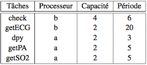

# Compte-rendu TP "Mdélisation AADL et ordonnancement"

**Mewen Michel et Sander Ricou - MI11 UTC**

Nous avons commencé le TP en ajoutant à Eclipse le plugin OSATE, puis en créant un lanceur pour Cheddar afin d'effectuer des simulations d'ordonnançabilité.

### Exercice 1 : Ordonnancement Rate Monotonic

Pour les questions suivantes nous avons trois tâches périodiques se définissant ainsi:


Q1. U = sum(Ci/Pi), i de 1 à n avec n= 3 #Latex
		-> U = 0,64 et n(2^n-1) = #calculer

Q2. Le critère de priorité est inversement proportionnelle à la période Pi. Plus la période est petite plus la tâche est prioritaire.
Donc nous avons :
 - T2, priorité de 255
 - T3, priorité de 254
 - T1, priorité de 253

Q3. On ajoute les paramètres suivants aux tâches:
  - "Period" 
  - "Compute_Execution_Time" 
  - "Deadline" 
  - "Cheddar_Properties::Dispatch_Absolute_Time" 

  et dans l'ordonnanceur nous ajoutons:
  - "Preemtive_Scheduler => False or True" par défaut en non preemptable.


  ```aadl
  #TODO ajouter code
  ```

Q4. Ordonnancement preemptif:


	#TODO *mettre image et texte 1-4 preempt*

Ordonnancement non preemptif:

	#TODO *mettre image et texte 1-4 preempt*

On constate que l'ordonnacement en non preemptif ne fonctionne pas, ce n'est pas schedulable. Ceci à cause de la première tâche (celle à la plus longue période) qui fait manquer les deadlines d'autres tâches.


Q5. Formons maintenant un jeu de tâche harmonique.

C'est tout juste ordonnançable ! 

#TODO latex, U = 1 (d'après cheddar), #TODO recalculer tout de même

Preemptif:

	#TODO *mettre image et texte 1-5 preempt*
Non preemptif:

	#TODO *mettre image et texte 1-5 non preempt*

On constate que c'est encore pire quand question 4 si les tâches ne sont pas preemptables. Cela s'explique par le fait que les tâches sont censés occuper la totalité de la période d'étude (U = 1). Or si elle ne peuvent se preempter les unes les autres, certaines ne vont pas être terminer avant leur deadline.
De plus on constate que si le test d'ordonnançabilité est vrai alors l'ordonnacement est possible mais l'inverse n'est pas forcément vrai.

#TODO calculer le U et voir que c'est au dessus de 1 mais que Cheddar arrive tout de même à ordonnancer, il faut également prendre en compte les temps de réponse.


Q6. Voir les différents temps de réponse dans les fichiers txt:
Vu les temps de réponse on voit qu'on respecte les deadlines alors qu'on a calculé un U trop grand...(test ordonnançabilité faux).

Il existe un algo dans le cours pour calculer les temps de réponse.


Conclusion en ordonnancement rate monotonic, avec des tâches non harmoniques, il peut y avoir des moments où on ne peut rien faire, où nous sommes obliger d'attendre ce qui fait que la période d'étude n'est pas pleinement occupée.


### Exercice 2 : Ordonnancement EDF

Nous avons maintenant trois nouvelles tâches périodiques, définies par:


Q1. #latex U = 5/12 + 2/6 + 5/24 < 1 donc c'est bon ! voir cours ce n'est plus inférieure ou égale à n(2^n+1).

Q2. Voici le code de notre fichier test_edf.aadl:
```aadl
#TODO

```

Q3. Il y a une unité de temps libre sur la période d'étude. En effet on a une période de 24 unités et elle est utilisée pendant 23/24 de son temps donc il reste 1/24*24= 1 unité de temps.

Q4. Voir schéma ordonnancement. et temps de réponse même.
Preemptif:

	#TODO *mettre image et texte 2-4 preempt*
Non preemptif:

	#TODO *mettre image et texte 2-4 non preempt*

Nous constatons bien l'unité de temps disponible.


Q5. Voici notre code après avoir ajouter le sdeux tâches apériodiques TA1 et TA2:
```aadl
#TODO

```


voir schéma puis temps de réponse calculé par Cheddar.
Preemptif:

	#TODO *mettre image et texte 2-5 preempt*

on sait qu'il y a 1 unité de temps disponible par période d'étude, et la somme des temps d'exécution des deux tâches apériodiques est égale à 4 donc il faudra une deadline de 4*24= 96 pour avoir les tâches apériodiques qui s'éxécutent sans perturber les autres.

Si on donne une deadline de 24 aux tâches apériodiques alors celles-ci vont mettre la tâche 3 en retard. Elle le rattrapera arrivé à 96 unité de temps, ce qui est logique (cf. paragraphe précédent). En fait, la TA2 prend 3 unité de temps dans la première période d'étude à la tâche 3 il faudra donc 3 période d'étude pour que la tâche 3 rattrape son retard (1 unité de temps reprise par période d'étude), ce qui fait bien 24 + 3*24 = 96.


### Exercice 3 : Moniteur médical multiparamètres

Q1.
Voici les différents critères qui nous ont permis d'affecter les priorités aux tâches:

- Criticité ou l'importance de la tâche, vaut il mieux déclencher cette tâche au lieu d'une autre ?

- Plus important de Checker des que possible pour éventuellement déclencher l'alarme au lieu d'afficher par exemple.

- Vitesse d'évolution des paramètres mesurés par la tâche. 

A ces critès quantitatifs s'ajoute également la période de la tâche.

Au final nous avons les priorités suivantes :
1- Check (255)
2- getECG (254)
3- getPA (253)
4- getSO2 (252)
5- dpy (251)

Nous supposons donc que l'affichage est le moins important, l'infirmière ne sera pas tout le temps derrière l'écran pour s'assurer des bons paramètres vitaux. Puis la saturation sanguine met du temps à se produire comparer à l'activité cardiaque. Et donc le plus important est le déclenchement de l'alarme par la tâche check qui a la priorité maximale.

Q2. Voici notre code pour le fichier health_monitor.aadl:
```aadl
#TODO

```

Q3. #TODO ajouter voir schéma + text renvoyé par Cheddar


Seulement la tâche display qui rate ça deadline et seulement une fois par période d'étude, ce qui n'est pas très grave aux vus des arguments exposés à la question 1.


Q4. Pour augmenter les performances du système, les tâches sont réparties sur deux processeurs (cpu_a et cpu_b). Avec les paramètres suivants:



Non la tâche getPA n'arrive pas à s'éxécuter... en effet si on veut excéuter les trois tâches sur le processeur a, il faudrait 147% du processeur, ceci est évidemment impossible.


#TODO ajouter schéma Cheddar et text associé 3 -4 

Q5. En regardant les périodes, on observe que getECG à la plus grande et dpy a la plus petite. Pour une période grande il n'y a pas besoin du cpu le plus rapide et inversement, pour une tâche à période courte il vaut mieux un cpu rapide. Nous échangeons donc les deux tâches de cpu, ce qui implique également de changer les capacité de chacune. On se retrouve alors avec les paramètres suivants:

#TODO voir feuille TP de mewen

Et attention il faut recalculer les priorités en fonction de la période (algo rate_Monotonic)


Q6. Voici le code final, après avoir ajouté les modifications de la questions précédentes:
```aadl

#TODO ajouter code
```


On se retrouve alors avec le schéma d'ordonnancement suivant:

#TODO ajouter schéma


Ouverture: en réalité irréalisable car utilisation de 100% du cpu par les tâches c'est impossible